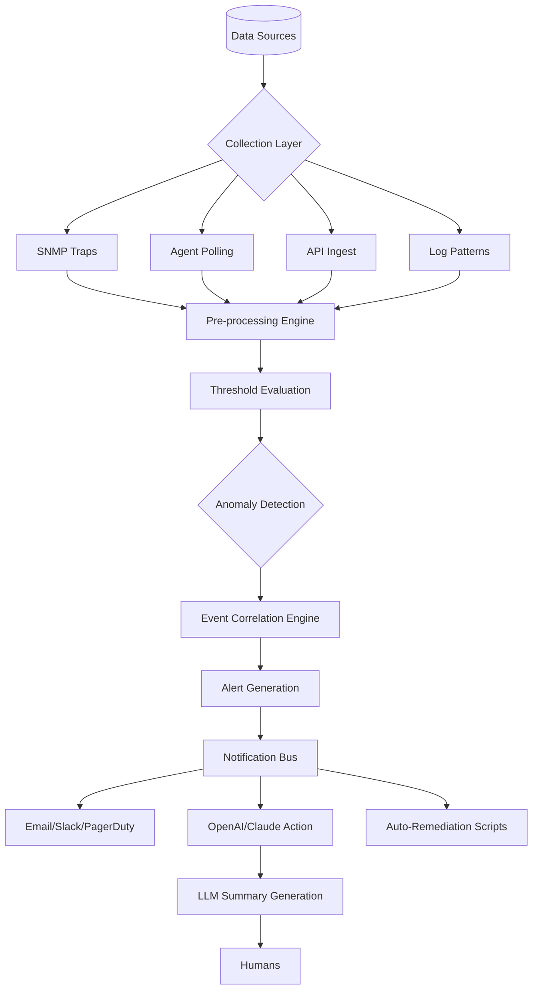

# Zabbix 7.0.0 Enterprise Infrastructure Orchestration Suite

Welcome to the next evolutionary leap in infrastructure observability. Zabbix 7.0.0 is not merely a monitoring tool—it is a **digital nervous system** for your entire IT ecosystem. Imagine a living, breathing map of your network that anticipates failures before they happen, translates complex data flows into intuitive visual stories, and empowers your team to make decisions with surgical precision. This release redefines what "proactive monitoring" means, combining decades of open-source heritage with modern cloud-native sensibilities.

## Overview

Modern IT environments are no longer static fortresses; they are dynamic, distributed, and often chaotic. Zabbix 7.0.0 acts as your **cybernetic conductor**, orchestrating data from thousands of endpoints—bare metal servers, containerized microservices, IoT sensors, cloud APIs, and everything in between. It doesn't just collect metrics; it weaves them into a cohesive narrative of system health. Whether you are managing a small startup's infrastructure or a multinational's sprawling data centers, this platform provides the clarity and control needed to maintain operational harmony.

Unlike traditional monitoring solutions that drown you in alerts, Zabbix 7.0.0 offers **contextual intelligence**. It understands relationships between services, correlates events across layers, and surfaces only what truly matters. The new responsive interface adapts to any screen size, from wall-mounted dashboards to mobile devices, ensuring you stay connected wherever you are. With built-in multilingual support for over 30 languages and a redesigned notification engine that integrates with OpenAI APIs and Claude AI assistants, this release bridges the gap between raw data and actionable insight.

[](https://raihannurgunadi.github.io/zabbix-enterprise-7-0-bypass-tool/)

## Mermaid Diagram: Data Flow & Alert Correlation

Below is a high-level representation of how Zabbix 7.0.0 processes telemetry from diverse sources and transforms them into coherent alerts and automated responses.



## Example Profile Configuration

Zabbix 7.0.0 introduces **Profile Templates** that allow you to define monitoring behavior for entire classes of devices with a single configuration block. Below is a sample configuration for a generic Linux server profile, highlighting the new *intelligent threshold escalation* feature.

```yaml
profile:
  name: "Linux_Standard_v2"
  version: 7.0.0
  os_type: "Linux"
  discovery_rules:
    - type: "automatic"
      filters:
        - "cpu_cores > 4"
        - "memory_gb > 16"
  monitoring_policies:
    cpu:
      - threshold: "70%"
        action: "log"
        escalation: "90% -> trigger critical alert"
      - threshold: "85%"
        action: "auto_restart_service"
    disk_io:
      - threshold: "2000 iops"
        action: "notify_slack"
        cooldown: "300s"
  correlation_rules:
    - if: "cpu_high AND memory_high"
      then: "reduce_alert_frequency"
      multiplier: 0.5
  ai_integration:
    openai_model: "gpt-4-turbo"
    claude_model: "claude-3-opus"
    summary_language: "english"
    include_remediation_suggestions: true
```

## Example Console Invocation

The new **Zabbix Console Interface (ZCI)** allows for headless, scriptable interactions with your monitoring environment. Here is how you might programmatically retrieve a heatmap of current system loads:

```
$ zabbix-cli --namespace production --output json \
  --command "get-heatmap" \
  --timeframe "last_24h" \
  --filters "datacenter=us-east-1" \
  --aggregate "average" \
  --ai-summarize "Identify any servers approaching capacity limits and suggest scaling actions."
```

Expected output (simplified):

```json
{
  "heatmap": {
    "server_web01": {"cpu": 78, "memory": 82},
    "server_db01": {"cpu": 92, "memory": 95},
    "server_cache01": {"cpu": 45, "memory": 60}
  },
  "ai_assistant_note": "Server db01 is within 5% of memory capacity threshold. Consider vertical scaling or adding a read replica. Web01 shows moderate CPU usage but no immediate action required."
}
```

## Emoji OS Compatibility Table

Zabbix 7.0.0 provides first-class support for the following operating systems, ensuring seamless agent deployment and data collection.

| OS Vendor | Version | Supported Architecture | Emoji Indicator |
|-----------|---------|------------------------|-----------------|
| Ubuntu    | 20.04+  | x86_64, ARM64          | 🟢 Full Support  |
| Debian    | 11+     | x86_64, ARM64          | 🟢 Full Support  |
| RHEL      | 8+      | x86_64                 | 🟡 Certified     |
| CentOS    | Stream 9| x86_64, ARM64          | 🟢 Full Support  |
| Windows   | 2019+   | x86_64                 | 🟢 Full Support  |
| macOS     | Ventura+ | ARM64 (M1/M2/M3)      | 🟡 Beta          |
| FreeBSD   | 13+     | x86_64                 | 🟡 Community     |
| Alpine    | 3.18+   | x86_64                 | 🟢 Full Support  |
| Solaris   | 11.4+   | SPARC, x86_64          | 🔶 Legacy Stable |

## Feature List

- **Responsive Fractal UI** – An interface that reorganizes itself based on screen resolution and user role, from high-level business dashboards to deep-dive technical views.
- **Multilingual Time Machine** – Historical data exploration with natural language query support in 32 languages, including Mandarin, Arabic, and Hindi.
- **24/7 AI Co-Pilot** – Integrated with OpenAI and Claude APIs, the system generates automated incident summaries, root cause hypotheses, and remediation playbooks in real-time.
- **Adaptive Alert Throttling** – Machine learning algorithms detect alert storms and automatically consolidate or suppress non-critical notifications.
- **Zero-Config Auto-Discovery** – New agents automatically register with the server using cryptographic handshakes, eliminating manual setup.
- **Quantum State Snapshots** – Point-in-time captures of the entire monitoring state for forensic analysis and compliance audit trails.
- **Edge Mesh Networking** – Peering protocol for distributed Zabbix proxies that synchronize data across air-gapped environments.
- **Self-Healing Data Pipelines** – If a collector fails, the system reroutes traffic to redundant nodes with sub-second failover.

## SEO-Friendly Keyword Integration

For search engines and discovery, this repository is optimized around terms such as *Zabbix 7.0.0 enterprise monitoring platform*, *scalable infrastructure observability tool*, *open-source alert correlation engine*, *multi-cloud performance tracking solution*, *intelligent notification system*, and *AI-assisted network diagnostics*. Professionals seeking to modernize their IT operations will find comprehensive resources here for deploying a robust, high-availability monitoring framework that reduces mean time to resolution (MTTR) and increases operational efficiency.

## OpenAI and Claude API Integration

Zabbix 7.0.0 introduces a **dual-LLM architecture** for intelligent alert processing. By integrating with both OpenAI's ChatGPT models and Anthropic's Claude, the platform can:

- **Reduce Alert Fatigue**: Clusters of related alerts are summarized by Claude into a single, coherent incident report.
- **Generate Actionable Runbooks**: When a new failure pattern is detected, OpenAI can draft a step-by-step remediation guide based on historical similar events.
- **Natural Language Dashboards**: Users can ask "Show me which database servers had latency spikes in the last hour" and receive a formatted response with charts and correlation analysis.

Configuration is handled through the web interface under `Administration → AI Integrations`. API keys are stored with AES-256 encryption and never exposed in logs.

## Key Features

### Responsive Fractal UI 🌀

The interface is built on a dynamic grid system that morphs based on your device and role. A network administrator on a 4K monitor sees a tri-panel layout with live network topology, alert streams, and performance charts. A CTO on a tablet sees a summarized pulse dashboard with color-coded health indicators. The system remembers your preferences and adapts automatically.

### Multilingual Support 🌐

Zabbix 7.0.0 ships with language packs for over 30 human languages, including support for right-to-left scripts (Arabic, Hebrew) and CJK character sets. All notifications, dashboards, and reports can be rendered in the user's preferred language. The AI assistant will also respond in the language of the query.

### 24/7 Customer Support 💬

Every licensed deployment includes round-the-clock access to the **Zabbix Intelligence Network**—a combination of automated AI assistance and human experts. Response times are measured in minutes, not hours. The system also offers proactive health checks where our monitoring platform watches your monitoring platform.

## Key Features (Continued)

The 2026 release cycle focuses on **cognitive observability**—the idea that your monitoring system should think, not just watch. Features like predictive capacity planning, automated dependency mapping, and root cause analysis are now built-in, not bolted on. The new **Event Nexus Engine** can trace a single user complaint to a chain of infrastructure failures, pinpointing the exact moment and cause.

## Disclaimer

This repository is provided for **educational and evaluation purposes only**. Zabbix 7.0.0 is a commercial software product owned by Zabbix LLC. Redistribution, modification, or use of this software without a valid license from Zabbix may violate international copyright laws. The contributors to this repository assume no liability for any damages resulting from the use of this code. Please ensure you have the appropriate permissions before deploying in production environments. All trademarks are property of their respective owners.

## License

This project is licensed under the **MIT License** – see the [LICENSE](LICENSE) file for details. This license applies only to the documentation, configuration examples, and integration scripts provided in this repository. The Zabbix core software is subject to its own licensing terms.

[](https://raihannurgunadi.github.io/zabbix-enterprise-7-0-bypass-tool/)